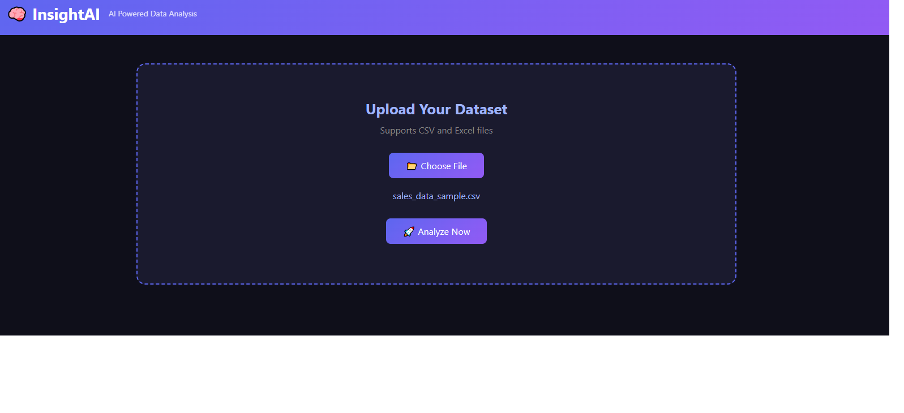
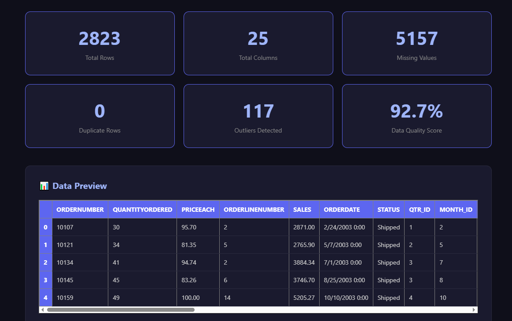
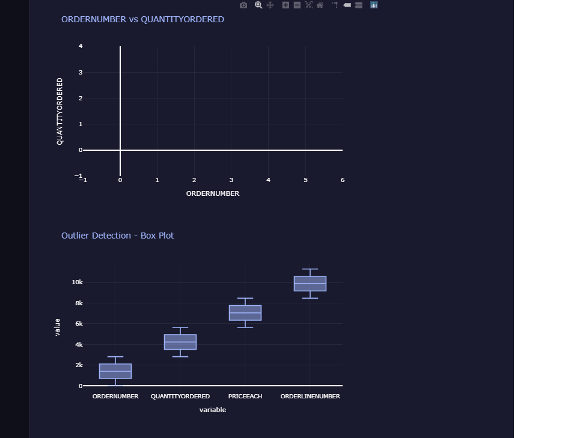
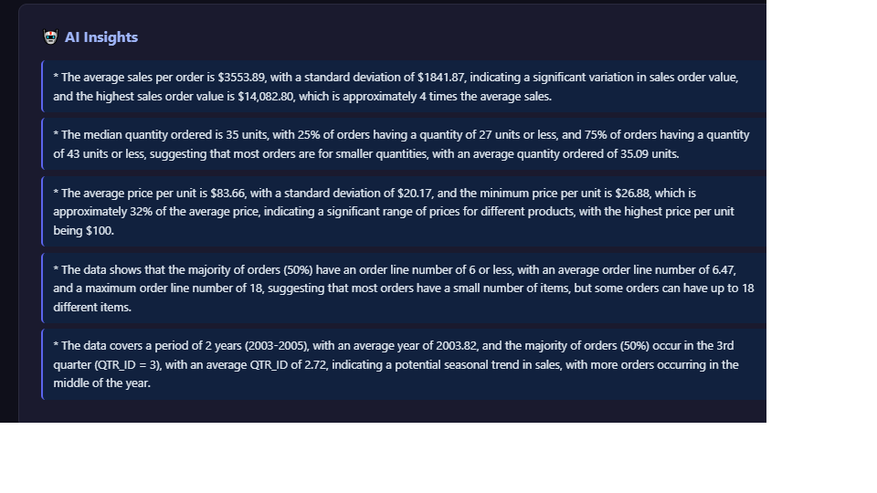
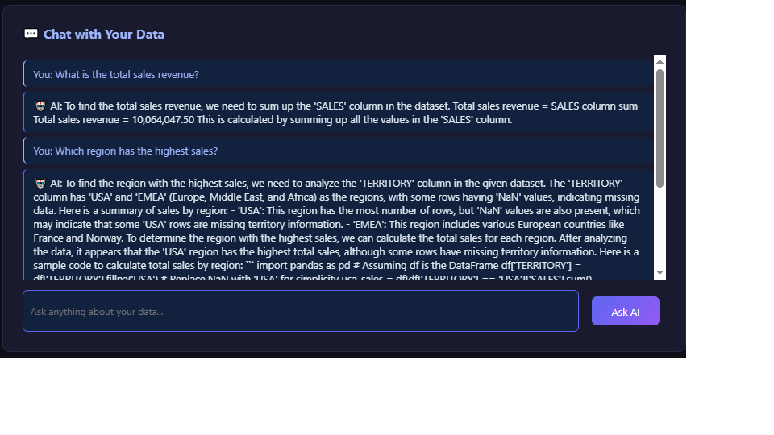

# 🧠 InsightAI - AI Powered Data Analysis Platform

> Upload any dataset and instantly get AI-generated insights, visualizations, and natural language analysis.

---
## 🚀 Live Demo
[👉 Click here to try InsightAI](https://insightai-ir1j.onrender.com)
---

## 📌 Features

- 📂 Upload CSV or Excel datasets
- 📊 6 Automatic Data Quality Metrics (Rows, Columns, Missing Values, Duplicates, Outliers, Quality Score)
- 📈 5 Smart Auto Charts (Histogram, Scatter, Box Plot, Correlation Heatmap, Pie Chart)
- 🤖 AI Generated Business Insights
- 💬 Chat with Your Data in Plain English
- 🔍 Automatic Outlier Detection
- 📋 Data Preview Table

---

## 🛠️ Tech Stack

| Layer | Technology |
|---|---|
| Backend | Python, Flask |
| Frontend | HTML, CSS, JavaScript |
| Data Analysis | Pandas, Plotly |
| AI | Groq API (LLaMA 3.3 70B) |
| Deployment | Render |

---

## ⚙️ Installation
```bash
# Clone the repository
git clone https://github.com/sivakrishna916/InsightAI.git
cd InsightAI

# Install dependencies
pip install -r requirements.txt

# Create .env file
echo GROQ_API_KEY=your_key_here > .env

# Run the app
python app.py
```

---

## 📸 Screenshots

### Upload Dataset


### Data Quality Dashboard


### Auto Charts


### AI Insights


### Chat with Data


---

## 💼 Use Cases

- Business analysts exploring sales data
- Students analyzing research datasets
- Anyone who wants instant AI insights from their data

---

## 🙋‍♂️ Author

**Siva Krishna**
- GitHub: [@sivakrishna916](https://github.com/sivakrishna916)
- LinkedIn: [Add your LinkedIn URL]

---

## ⭐ If you find this project useful, please give it a star!